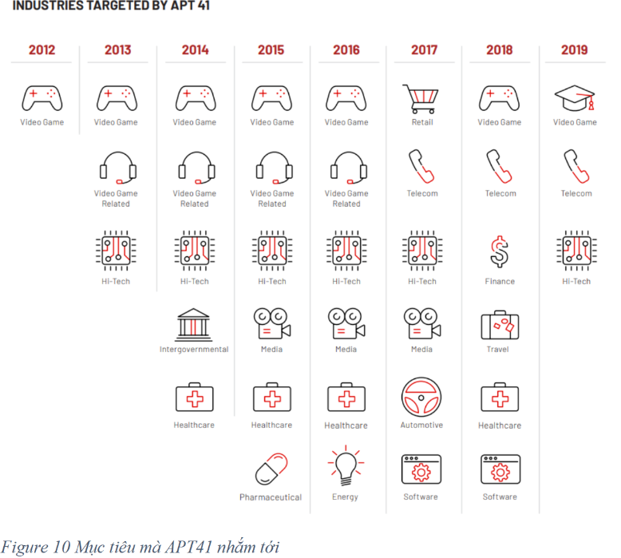
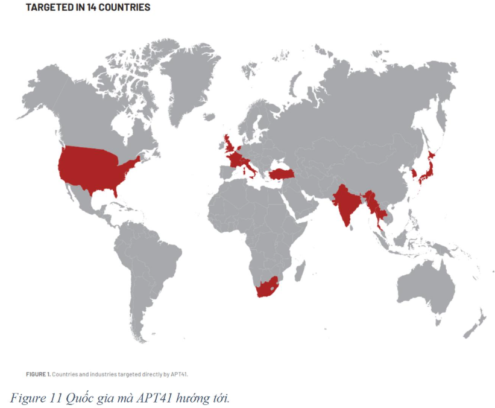
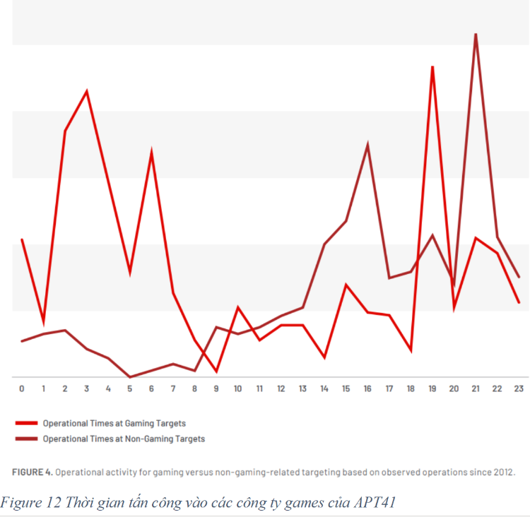
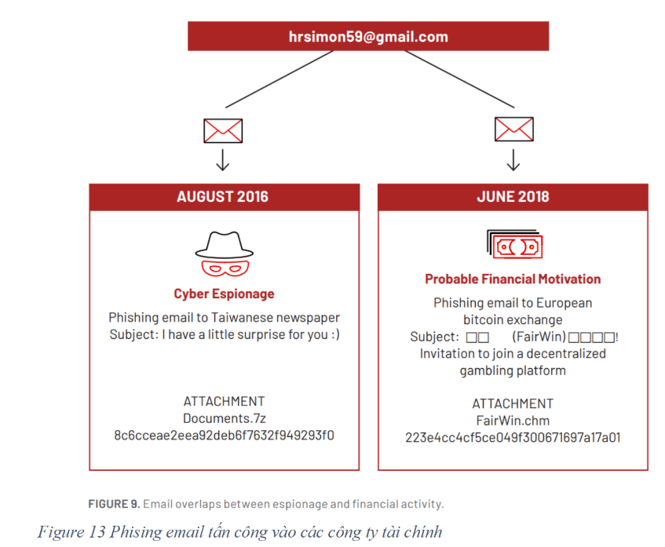
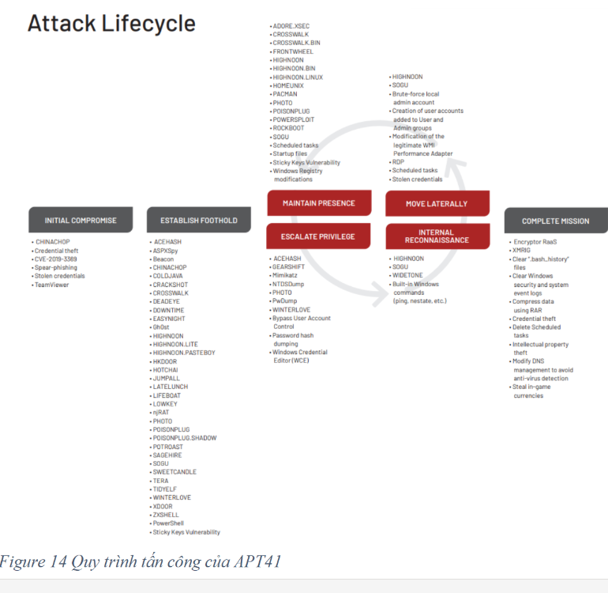
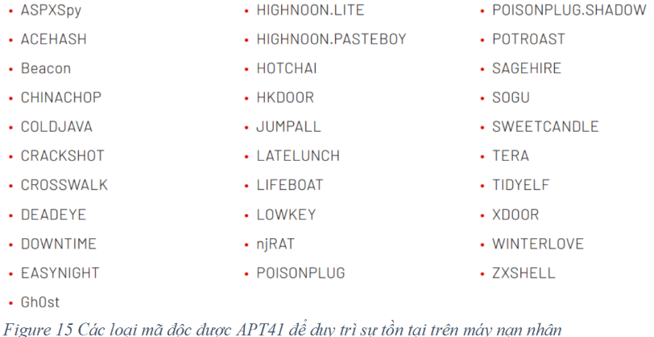
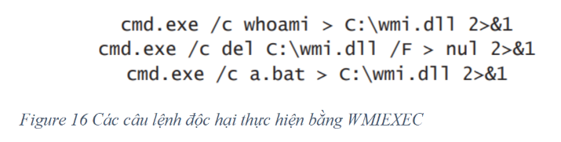

# File Infecting Virus & Advanced Virus Techniques

## Table of Contents

1. [Mô tả](#mô-tả)
2. [Triển khai](#triển-khai)
    - [Thiết kế Payload Lây Nhiễm](#thiết-kế-payload-lây-nhiễm)
      - [Shellcode](#shellcode)
      - [Đọc các thành phần trong tệp tin PE và chỉnh sửa địa chỉ entry point](#đọc-các-thành-phần-trong-tệp-tin-pe-và-chỉnh-sửa-địa-chỉ-entry-point)
      - [Thêm mới section](#thêm-mới-section)
         - [Ý tưởng thực hiện](#ý-tưởng-thực-hiện)
         - [Tạo section mới](#tạo-section-mới)
         - [Thay đổi địa chỉ EntryPoint của chương trình](#thay-đổi-địa-chỉ-entrypoint-của-chương-trình)
         - [Chỉnh sửa shellcode để sau khi thực thi chương trình sẽ quay về địa chỉ entry point ban đầu](#chỉnh-sửa-shellcode-để-sau-khi-thực-thi-chương-trình-sẽ-quay-về-địa-chỉ-entry-point-ban-đầu)
      - [Lây nhiễm sang các tệp tin cùng thư mục](#lây-nhiễm-sang-các-tệp-tin-cùng-thư-mục)
         - [Bỏ qua các file đã bị lây nhiễm](#bỏ-qua-các-file-đã-bị-lây-nhiễm)
      - [DEMO lây nhiễm tệp tin trong cùng thư mục](#demo-lây-nhiễm-tệp-tin-trong-cùng-thư-mục)
3. [Phát hiện và Trốn Tránh Máy Ảo và Debugger](#phát-hiện-và-trốn-tránh-máy-ảo-và-debugger)
    - [Nguyên lý phát hiện sandbox](#nguyên-lý-phát-hiện-sandbox)
      - [Nguyên lý phát hiện sandbox trong VMWARE](#nguyên-lý-phát-hiện-sandbox-trong-vmware)
      - [Nguyên lý phát hiện sandbox trong Cuckoo Sandbox](#nguyên-lý-phát-hiện-sandbox-trong-cuckoo-sandbox)
    - [Anti-debugging, Anti-VM](#anti-debugging-anti-vm)
      - [Nhận biết đang chạy trong môi trường máy ảo](#nhận-biết-đang-chạy-trong-môi-trường-máy-ảo)
      - [Nhận biết, phát hiện đang bị gỡ lỗi (debugging)](#nhận-biết-phát-hiện-đang-bị-gỡ-lỗi-debugging)
    - [Kịch bản demo](#kịch-bản-demo)
4. [Environmental Keying](#environmental-keying)
5. [APT41](#apt41)
    - [Tổng quan về APT41](#tổng-quan-về-apt41)
    - [Sử dụng code-signing để phát tán mã độc](#sử-dụng-code-signing-để-phát-tán-mã-độc)
    - [Sơ đồ lây nhiễm](#sơ-đồ-lây-nhiễm)
      - [Bước1: Initial Compromise](#bước1-initial-compromise)
      - [Bước2: Establish Foothold](#bước2-establish-foothold)
      - [Bước4: Escalate Privileges](#bước4-escalate-privileges)
      - [Bước5: Internal Reconnaissance](#bước5-internal-reconnaissance)
      - [Bước6: Lateral Movement](#bước6-lateral-movement)
      - [Bước7: Maintain Presence](#bước7-maintain-presence)
      - [Bước8: Complete Mission](#bước8-complete-mission)
    - [Kỹ thuật Environmental Keying mà APT41 sử dụng](#kỹ-thuật-environmental-keying-mà-apt41-sử-dụng)
6. [Tham khảo](#tham-khảo)

# Mô tả

Viết chương trình lây nhiễm virus vào tập tin thực thi (tập tin thực thi trên Windows 
– PE file 32 bits) có tính năng đơn giản (mục đích demo giáo dục) như yêu cầu bên 
dưới.
Về chức năng, mục đích:
- Hiển thị thông điệp ra màn hình thông qua cửa sổ “pop-up” với tiêu đề cửa sổ là 
“Infection by NT230” và cấu trúc thông điệp là “MSSV01_MSSV02_MSSV03” 
(thông tin MSSV của các thành viên trong nhóm). Lưu ý: không có dấu “”.
- Hoàn trả chức năng gốc ban đầu của chương trình bị lây nhiễm (không phá hủy 
chức năng của chương trình chủ).
- Tóm lại: một tập tin bị nhiễm virus sẽ in ra thông điệp khi người dùng kích hoạt 
chương trình, cố gắng lây nhiễm sang tập tin khác trong cùng thư mục, rồi thực 
thi chức năng ban đầu của tập tin. Đối với việc lây nhiễm sang một tập tin khác, 
nếu đối tượng là một tập tin đã bị nhiễm, chương trình virus sẽ bỏ qua. Nếu đối 
tượng là tập tin không bị nhiễm, hoạt động lây nhiễm payload vào tập tin thực thi 
sẽ được kích hoạt.
Về cách lây nhiễm:
- Mức yêu cầu 01 - RQ01 : Thực hiện chèn mã độc vào process bình thường bằng 
cách sử dụng section .reloc, tạo và nối mới section trong tập tin thực thi để tiêm 
payload của virus (hoặc kỹ thuật process hollowing).
- Mức yêu cầu 02 - RQ02 : Virus đạt được RQ01 và có khả năng lây nhiễm qua 
các file thực thi khác cùng thư mục khi người dùng kích hoạt tập tin chủ.
- Mức yêu cầu 03 - RQ03 : Thay vì thay đổi Entry-point của chương trình, Hãy 
áp dụng lần lượt 02 chiến lược lây nhiễm trong nhóm kỹ thuật Entry-Point 
Obscuring (EPO) virus – che giấu điểm đầu vào thực thi của mã virus (virus code)
cho Virus đã thực hiện ở RQ01/RQ02. Một số dạng EPO-virus có thể xem xét để 
thực hiện yêu cầu này bao gồm:
o Call hijacking EPO virus
o Import Address Table-replacing EPO virus.
o TLS-based EPO virus.

# Triển khai

## THIẾT KẾ PAYLOAD LÂY NHIỄM:

### Shellcode 

Sử dụng công cụ msfvenom của để tạo shellcode, nội dung shellcode này sẽ hiển thị một message box với nội dung và tiêu đề như yêu cầu trên.

Trong source code C++, sử dụng vector để lưu giá trị shellcode

### Đọc các thành phần trong tệp tin PE và chỉnh sửa địa chỉ entry point.

Xây dựng hàm đọc và lấy ra các thông tin như DOS_Header, NT_Headers và Section_Headers

Đoạn code trên sẽ tạo một section mới có tên là “.infect”, kích thước section là kích thước shellcode + 14(dùng để chèn thêm các vị trí return address và padding). Kết quả hàm trả về là vị trí của section mới trên file.

### Thêm mới section.

#### Ý tưởng thực hiện
Xác định kích thước của đoạn shellcode cần chèn vào, rồi tạo section mới có kích thước bằng kích thước của đoạn shellcode.
Cần xác định section cuối, sau đó thay đổi các tham số mới dựa trên section cuối.

Sau khi thay đổi địa chỉ Entrypoint của chương trình và chỉ đến địa chỉ của shellcode, sau khi shell code được thực thi xong sẽ có thể quay về địa chỉ ban đầu entrypoint cũ để chương trình thực hiện chức năng gốc.

#### Tạo section mới:

Thiết lập tên section là ‘.infect’ và byte cuối cùng gán là NULL.

Địa chỉ VirtualAddress sẽ bằng địa chỉ VirtualAddress của section cuối cộng với kích thước của section cuối rồi làm tròn bằng sectionAlignment trong Optional Headers.

Kích thước VirtualSize sẽ gán là kích thước của shellcode rồi làm tròn bằng sectionAlignment.

PointerTorawData sẽ bằng PointerToRawData của section cuối cộng với SizeOfRawData của section cuối sau đó làm tròn bằng FileAlignment trong Optional Headers.

SizeOfRawData sẽ bằng kích thước của shellcode và làm tròn bằng FileAlignment.

Characteristics sẽ gán là đọc, viết, thực thi và chứa code.

Công thức để làm tròn của các trường có dạng như sau:

Trong đó:

Alignment: là FileAlignment hoặc SectionalAlignment trong OptionalHeader.

Value_to_align: Giá trị cần làm tròn.

#### Thay đổi địa chỉ EntryPoint của chương trình

Sau khi tạo mới section địa chỉ entry point mới của chương trình trong optional Headers sẽ chỉ đến địa chỉ PoinToRawData của section mới vừa tạo.

#### Chỉnh sửa shellcode để sau khi thực thi chương trình sẽ quay về địa chỉ entry point ban đầu
Vì trong payload do metasploite tạo ra, có sử dụng hàm ExitProcess(), nên em sẽ thay hàm này bằng lệnh call để nhảy đến địa chỉ EntryPoint.

Địa chỉ EntryPoint cũ khi thêm vào shellcode sẽ có dạng LittleEndian.

## Lây nhiễm sang các tệp tin cùng thư mục

Viết hàm liệt kê các file trong thư mục hiện tại, rồi kiểm tra các file đó có phải là một file thực thi PE hợp lệ không, sau đó lây nhiễm.

### Bỏ qua các file đã bị lây nhiễm:

Chương trình sẽ kiểm tra section cuối của chương trình có phải tên là .infect không. Nếu có thì bỏ qua, nếu không sẽ lây nhiễm.

Đoạn code trên sẽ liệt kê tất cả các file trong thư mục hiện tại sau đó kiểm tra xem file có phải là file PE hợp lệ không và đã bị lây nhiễm chưa. Hàm infectedFile sẽ lây nhiễm file bằng cách tạo section mới, thay đổi địa chỉ entrypoint, thêm địa chỉ entry point cũ vào shellcode sau đó chèn shellcode vào vùng nhớ của section mới tạo

## DEMO lây nhiễm tệp tin trong cùng thư mục:

Sau khi lây nhiễm Các file là Notepad và Calc đều bị lây nhiễm.

# PHÁT HIỆN VÀ TRỐN TRÁNH MÁY ẢO VÀ DEBUGGE

## Nguyên lý phát hiện sandbox (thí dụ như Cuckoo Sandbox,…). Các kỹ thuật nhận diện sandbox để trốn tránh cho mã độc.

### Nguyên lý phát hiện sandbox trong VMWARE

Các môi trường sandbox Vmware thường để lại các file của Vmware trong hệ điều hành đặc biệt khi cài Vmware tools.

- Trong môi trường Vmware bằng việc tìm kiếm các tiến trình của vmware :

+ VMwareService.exe

+ VMwareTray.exe

+ VMwareUser.exe

Bằng việc tìm kiếm các file này mã độc sẽ phát hiện được có đang trong máy ảo Vmware không.

- Tìm kiếm các registry và file hệ thống:

+ Bằng việc tìm kiếm trong thư mục C:\Program Files\VMware\VMware Tools. Mã độc có thể tìm kiếm các dữ liệu liên quan đến Vmware và từ đó phát hiện đang trong môi trường máy ảo.

+ Tìm kiếm trong registry xem có các từ khóa Vmware, nếu có mã độc sẽ nhận biết đang trong mói trường máy ảo vmware.

Sử dụng đo lường mức độ tương tác của người dùng ví dụ: chuột, bàn phím.

Kiểm tra các tiến trình, xem có tiến trình nào của sandbox đang chạy không.

### Nguyên lý phát hiện sandbox trong Cuckoo Sandbox

Trong môi trường sandbox thường có độ trễ do cơ chế ảo hóa, giám sát. Điều này có thể làm yếu tố để phát hiện môi trường sanbox.

## Kỹ thuật:
+ Đo lường thời gian thực thi của một hàm. Nếu thời gian thực thi không được như mong đợi . Lý do vì trong Cuckoo sandbox (khi phân tích mã độc) nó sẽ bỏ qua N giây để trì hoãn thực thi hàm khi chương trình mã độc chạy. Điều này có nghĩ nếu hàm NtDelayExecution không hoạt động chính xác thì có nghĩ nó đang trong môi trường sandbox.

+ Tạo nhiều vòng lặp cho hàm Sleep. Nguyên do là vì trong môi trường sandbox, nó sẽ tự động bỏ qua hay cắt giảm thời gian của hàm Sleep, do đó nếu thời gian Sleep không hoạt động đúng thì có khả năng là đang trong môi trường sandbox.

+ Đo số chu kì CPU từ khi khởi động: Bằng cách đo thời gian thực thi các lệnh GetProcessHeap, CloseHandle. Điều này là do trong Sandbox thì các lệnh này bị chậm đáng kể so với trên máy thật.

+ Gửi lệnh ICMP và chờ phản hồi. Trong môi trường sandbox thì thì thời gian phản hồi sẽ kéo dài, do có nhiều lớp giám sát.

# anti-debugging, anti-VM

+ Nhận biết đang chạy trong môi trường máy ảo, 
+ Nhận biết, phát hiện đang bị gỡ lỗi (debugging),
Một khi nhận biết đang bị đặt trong môi trường phân tích, nó sẽ không thực hiện 
hành vi, không thể hiện bản chất của mình (vd: payload không thực thi đoạn mã 
mục tiêu cho trước, dừng chương trình…). 

## Nhận biết đang chạy trong môi trường máy ảo.

Hình 1: Hàm vmware_reg_key_value sẽ kiểm tra trong registry xem có từ khóa VMWARE nào không, nếu có thì là đang trong môi trường VMWARE.

Hình 2 cho thấy hàm vmware_reg_keys sẽ kiểm tra có cài đặt Vmware Tools trong registry không, nếu có thì đang trong môi trường vmware.

Hình 3 sẽ kiểm tra các file trong hệ thống có chứa vmware không.

Hình 4 dùng để kiểm tra các địa chỉ MAC của VMWARE

## Nhận biết, phát hiện đang bị gỡ lỗi (debugging).

Hình 9 sử dụng hàm IsDebuggerPresent, hàm này của thư viện window API dùng để kiểm tra user mode debug có được bật không.

Hình 8 là hàm tương tự IsDebuggerPresent dùng để kiểm tra cờ BeingDebugged có được bật không

Hình 9 là hàm của Win api. Dùng để kiểm tra tiến trình có bị debug không

Hình 10, hàm này sẻ trả về True nếu phát hiện debug. Nguyên lý là khi tiến trình bị debug nếu gọi hàm này sẽ trả về status code là 0xC0000008

Nguyên lý của hàm này :

- Phát hiện debug bằng hàm IsDebuggerPresent(một hàm của window api)

- Sử dụng cờ MEM_WRITE_WATCH: sử dụng cờ này để theo dõi hoạt động ghi vùng nhớ này. Hàm GetWriteWatch sẽ cung cấp thông tin về các trang nhớ từ khi cấp phát đã bị ghi vào.

- Khi debugger can thiệp nó sẽ gây ra hoạt động không mong muốn và ghi vào vùng nhớ. Vì hàm GetWriteWatch cho biết có bao nhiêu trang nhớ đã bị ghi nên nếu số trang nhớ bị ghi không phải 1 thì chứng tỏ có hoạt động của debugger. Ngoài ra hàm IsDebuggerPresent trả về True cũng thể hiện đang bị debug.

## Kịch bản demo

- Ở đây em sử dụng file NOTEPAD.exe để thực hiện chèn payload vào section cuối của file, section có tên là .infected.

### Với phát hiện máy ảo:

- Em thực hiện thử nghiệm trên 2 môi trường là Window Vmware (máy ảo VMware)và Window trên Amazon cloud(em mặc định đây là máy thật).

### Với phát hiện debugger :

Em thực hiện chạy bằng phần mềm X64dbg ở chế độ debug, em chạy trên máy ảo Vmware và tắt chế độ phát hiện máy ảo đi. Khi em debug thì mã độc sẽ phát hiện và không thực thi lây nhiễm. Còn khi em dùng chế độ chạy bình thường thì mã độc sẽ lây nhiễm.

Kết quả: khi chạy trên phần mềm VMware, mã độc sẽ in ra màn hình phát hiện môi trường Vmware và không thực thi mã độc. Ngược lại khi chạy trên môi trường của window của amazon thì sẽ thực thi payload vào file NOTEPAD.exe và in ra màn hình 20521143

Khi chạy trên máy ảo và tắt chế độ phát hiện máy ảo, nếu chạy bằng x64dbg thì mã độc sẽ in ra màn hình phát hiện debugger và không thực thi payload. Ngược lại nếu em chạy bằng cửa sổ dòng lệnh của window thì nó sẽ thực thi payload và khi chạy file NOTEPAD.exe sẽ in ra màn hình của sổ có 20521143.

# Environmental Keying

Đây là một kỹ thuật cho phép các loại mã độc có khả năng giải mã các đoạn payload mã độc dựa trên một môi trường máy tính mục tiêu cụ thể:

Ưu điểm: cho phép chỉ giải mã và thực thi đoạn mã độc cho mục tiêu đối tượng cụ thể. Tránh thực thi mã độc trên tất cả đối tượng. Điều nay giúm tăng khả năng trốn tránh, giảm thiểu rủi ro bị phát hiện.

Nhược điểm: Cần hiểu biết rõ về mục tiêu và đối tượng nhắm đến và đặc điểm cụ thể của của đối tượng.

Em chọn tìm hiểu về cách thức sử dụng kỹ thuật này trong mã độc APT41.

# APT41

## Tổng quan về APT41
Sơ lược: APT41 là loại mã độc được tạo ra, điều khiển bởi một nhóm hacker người Trung Quốc. Đối tượng mà loại mã độc này hướng tới nhằm vào các công ty, tổ chức liên quan

đến trò chơi điện tử, điện tín, sức khỏe. Mục đích của mã độc này nhằm đánh cắp các tài khoản chứng thực, các loại tài sản số của các tổ chức.

Như hình 10 cho thấy đối tượng mà APT41 nhắm tới nhiều nhất là các công ty video game.

Ngoài ra đối tượng hướng tới của APT41 rất đa dạng.

Nhận thấy các quốc gia mà APT41 hướng tới đều là quốc gia có nền công nghiệp game và phần mềm phát triển mạnh như Nhật Bản, Mỹ và Hàn Quốc, Ấn Độ v.v

Hình trên cho thấy thời gian tấn công của Apt41 theo khung thời gian của Trung Quốc. Nhận thấy vào thời điểm từ 18h tới 9 h sáng. Thời gian này là thời gian các nhân viên của công ty nghỉ ngơi.

Hình 13 mô tả quy trình gửi phising email nhằm vào các công ty tài chính. Nhận thấy cá hacker đã tìm hiểu rất kỹ về các công ty này khi gửi mail, ngoài ra trong các tệp mail đính kèm các tệp tin có chứa mã độc

## Sử dụng code-signing để phát tán mã độc

Bằng việc chiếm được các private key của các chữ ký số hợp lệ của các công ty phát triển phần mềm, game. Thông qua việc phising email hay mua các private key ở chợ đen. nhóm APT41 sẽ dùng nó để ký vô các phần mềm của họ để phát tán mã độc. Điều này sẽ giúp mã độc qua mặt được các cơ chế bảo vệ của các hệ thống.

## Sơ đồ lây nhiễm

### Bước1: Initial Compromise(xâm nhập)

APT41 sử dụng nhiều kỹ thuật đa dạng để xâm nhập vào đối tượng mục tiêu, cụ thể các kỹ thuật sau

· Spear-phising: Kỹ thuật này nhắm vào mục tiêu cụ thể (thông qua tìm hiểu cụ thể về đối tượng, gửi mail có kèm theo các tệp mã độc).

· TeamViewer: Team Viewer là một phần mềm cho phép làm việc từ xa thông qua cơ chế Remote Desktop. APT41 sử dụng phần mềm này để truyền các file DLL có chứa backdoor(CROSSWALK backdoor, HIGHNOON backdoor).

· Khai thác các lỗ hổng CVE.

### Bước2: Establish Foothold

Sau khi xâm nhập được vào đối tượng mục tiêu, APT41 sử dụng nhiều các loại mã độc khác nhau để duy trì thiết lập chỗ đứng trên máy nạn nhân.

Các loại mã độc được APT41 trong giai đoạn này sẽ được cài trên thư mục `c:\windows\temp`

Các mã độc này thược được giả dạng là các file của các phân mềm anti-virus ví dụ như:

· macfee.ga

· kasparsky.net

· symanteclabs.com

Các domain mà các mã độc này dùng để thực hiện C&C (Command and controls) cũng được giả dạng thành các domain hợp lệ, cụ thể là tên miền của các anti-virus.

### Bước4 Escalate Privileges(Leo thang đặc quyền)

APT41 sử dụng các công cụ nổi tiếng để thực hiện leo thang đặc quyền(chiếm các quyền cao hơn trên máy mục tiêu), cụ thể các công cụ sau :

· Mimikatz

· PwDump

· WINTERLOVE

· ACEHASH

· NTDSDump

· PHOTO

Ngoài ra công cụ Windows Credential Editor cũng được APT41 sử dụng để lấy các password hash làm chứng thực các tài khoản khác trong hệ thống của nạn nhân.

### Bước5: Internal Reconnaissance(Do thám mạng nội bộ)

Ở giai đoạn này APT41 sẽ thu thập các máy trong mạng của mục tiêu. Các công cụ của window như ‘netstat’, ‘net share’ được sử dụng để liệt kê các thông tin về mạng.

Ngoài ra các logs trong các máy bị kiểm soát cũng được dùng trong giai đoạn này.

Hơn nữa các loại mã độc được dùng để làm tác vụ này :

· HIGHNOON: thu thập thông tin máy host và liệt kê các port Remote Desktop Protocol (RDP)

· SOGU: liệt kê các thông tin kết nối trên giao thức TCP, UDP

· WIDETONE: scan port, và tấn công brute force password, thu thập các thông tin về network

### Bước6: Lateral Movement

Ở giai đoạn này APT41 sẽ lây nhiễm và chiếm quyền điều khiển các máy khác. APT41 sử dụng nhiều chiến lược để thực hiện mục tiêu trên, cụ thể

· Sử dụng đánh cắp các tài khoản chứng thực.

· Sử dụng các chữ ký số, các private keys hợp lệ để ký vào các phần mềm game hợp lệ và phát tán mã độc.

· Thêm tài khoản vào nhóm User và Admin

· Brute force mật khẩu

· RDP session.

· Chỉnh sửa các dịch vụ widow hợp lệ để cài đặt các backdoor như HIGNOON, SOGU

Với các tài khoản chiếm đoạt được , APT41 sẽ thực hiện thực hiện viết các mã độc HIGNOON có chứa payload và thông tin C&C. Sau đó thực thi các payload này bằng cách chỉnh sửa Windows WMI Performance Adaptor (wmiApSrv).

Ngoài ra APT41 cũng sử dụng WMIEXEC (công cụ dùng để thực thi các câu lệnh WMI trên các máy từ xa ) để thực hiện các câu lệnh độc hại, ví dụ:

### Bước7: Maintain Presence (Duy trì tồn tại trên máy nạn nhân)

Để thực hiện duy trì sự tồn tại lâu dài trên máy nạn nhân, APT41 sử dụng các kỹ thuật sau:

· Backdoor

· Chỉnh sủa startup file

· Chỉnh sửa registry

· Rootkits

· Bootkits

· scheduled tasks

· Sticky Keys vulnerability

· Chỉnh sửa các luật trong tường lửa ví dụ cho phép truyền file bằng giao thức SMB.

Để tránh sự phát hiện C&C, APT41 sử dụng các tên miền hợp lệ để tải các payload đã được mã hóa về máy nạn nhân. Các tên miền hợp lệ được sử dụng là : github, Pastebin, Microsoft TechNet

Ngoài ra các backdoor cũng được chạy trong các port hợp lệ của ứng dụng để giảm khả năng bị phát hiện

Hơn nữa APT41 cũng ngăn cản máy nạn nhân tải các phần mềm cập nhật của các phần mềm anti-virus bằng cách thay đổi các trường DNS, cụ thể các tên miền được dùng để cập nhật các phần mềm antivirus sẽ được forward lookup đến địa chỉ IP 1.1.1.1

### Bước8: Complete Mission

APT41 sử dụng file nén rar để truyền ra bên ngoài (exfiltration)

APT41 cũng thực hiện xóa các dấu vết ví dụ: xóa lịch sử bash, xóa các sự kiện lịch sử trong Windows, chỉnh sửa DNS

### Kỹ thuật Environmental Keying mà APT41 sử dụng trong 2 giai đoạn là :

* Bước1: Initial Compromise(xâm nhập)

* Bước6: Lateral Movement

Sau khi có được các thông tin của máy mục tiêu ,bao gồm địa chỉ máy MAC, số Serial của ổ C:\ (điều này có được thông qua bước Bước5: Internal Reconnaissance(Do thám mạng nội bộ) )

Các payload mã độc sẽ được mã hóa với key là địa chỉ máy MAC hoặc số Serial của ổ C:\

Vì địa chỉ MAC và Serial ở C:\ là duy nhất cho mỗi máy nên chỉ có mục tiêu cụ thể thì mã độc mới được thực thi

# Tham khảo

[1] Mandiant (no date) APT41 chinese cyber threat group: Espionage & cyber crime, Mandiant. Available at: https://www.mandiant.com/resources/blog/apt41-dual-espionage-and-cyber-crime-operation (Accessed: 15 May 2024).

[2] LordNoteworthy (no date) Lordnoteworthy/Al-Khaser at 967afa0d783ff9625caf1b069e3cd1246836b09f, GitHub. Available at: https://github.com/LordNoteworthy/al-khaser/tree/967afa0d783ff9625caf1b069e3cd1246836b09f (Accessed: 15 May 2024).

[3] MITRE. (2024). MITRE ATT&CKTM. Mitre.org. https://attack.mitre.org/

‌[4] FBI. (n.d.). APT 41 GROUP. Federal Bureau of Investigation. https://www.fbi.gov/wanted/cyber/apt-41-group

‌[5] APT41, Group G0096 | MITRE ATT&CK®. (2019, September 23). Attack.mitre.org. https://attack.mitre.org/groups/G0096/

‌[6] Anti-debugging and anti-VM techniques and anti-emulation [updated 2019] | Infosec. (2019). Infosecinstitute.com. https://www.infosecinstitute.com/resources/hacking/anti-debugging-and-anti-vm-techniques-and-anti-emulation/

‌[7] Guibernau, F. (2020). Catch Me If You {Can!—Detecting} Sandbox Evasion Techniques. Usenix.org. https://www.usenix.org/conference/enigma2020/presentation/guibernau

‌
[8] Writing and Compiling Shellcode in C | Red Team Notes. (2020, November 25). Ired.team. https://www.ired.team/offensive-security/code-injection-process-injection/writing-and-compiling-shellcode-in-c

‌