# File Infecting Virus & Advanced Virus Techniques

# Mô tả

Viết chương trình lây nhiễm virus vào tập tin thực thi (tập tin thực thi trên Windows 
– PE file 32 bits) có tính năng đơn giản (mục đích demo giáo dục) như yêu cầu bên 
dưới.
Về chức năng, mục đích:
- Hiển thị thông điệp ra màn hình thông qua cửa sổ “pop-up” với tiêu đề cửa sổ là 
“Infection by NT230” và cấu trúc thông điệp là “MSSV01_MSSV02_MSSV03” 
(thông tin MSSV của các thành viên trong nhóm). Lưu ý: không có dấu “”.
- Hoàn trả chức năng gốc ban đầu của chương trình bị lây nhiễm (không phá hủy 
chức năng của chương trình chủ).
- Tóm lại: một tập tin bị nhiễm virus sẽ in ra thông điệp khi người dùng kích hoạt 
chương trình, cố gắng lây nhiễm sang tập tin khác trong cùng thư mục, rồi thực 
thi chức năng ban đầu của tập tin. Đối với việc lây nhiễm sang một tập tin khác, 
nếu đối tượng là một tập tin đã bị nhiễm, chương trình virus sẽ bỏ qua. Nếu đối 
tượng là tập tin không bị nhiễm, hoạt động lây nhiễm payload vào tập tin thực thi 
sẽ được kích hoạt.
Về cách lây nhiễm:
- Mức yêu cầu 01 - RQ01 : Thực hiện chèn mã độc vào process bình thường bằng 
cách sử dụng section .reloc, tạo và nối mới section trong tập tin thực thi để tiêm 
payload của virus (hoặc kỹ thuật process hollowing).
- Mức yêu cầu 02 - RQ02 : Virus đạt được RQ01 và có khả năng lây nhiễm qua 
các file thực thi khác cùng thư mục khi người dùng kích hoạt tập tin chủ.
- Mức yêu cầu 03 - RQ03 : Thay vì thay đổi Entry-point của chương trình, Hãy 
áp dụng lần lượt 02 chiến lược lây nhiễm trong nhóm kỹ thuật Entry-Point 
Obscuring (EPO) virus – che giấu điểm đầu vào thực thi của mã virus (virus code)
cho Virus đã thực hiện ở RQ01/RQ02. Một số dạng EPO-virus có thể xem xét để 
thực hiện yêu cầu này bao gồm:
o Call hijacking EPO virus
o Import Address Table-replacing EPO virus.
o TLS-based EPO virus.

# Triển khai

## THIẾT KẾ PAYLOAD LÂY NHIỄM:

### Shellcode 

Sử dụng công cụ msfvenom của để tạo shellcode, nội dung shellcode này sẽ hiển thị một message box với nội dung và tiêu đề như yêu cầu trên.

Trong source code C++, sử dụng vector để lưu giá trị shellcode

### Đọc các thành phần trong tệp tin PE và chỉnh sửa địa chỉ entry point.

Xây dựng hàm đọc và lấy ra các thông tin như DOS_Header, NT_Headers và Section_Headers

Đoạn code trên sẽ tạo một section mới có tên là “.infect”, kích thước section là kích thước shellcode + 14(dùng để chèn thêm các vị trí return address và padding). Kết quả hàm trả về là vị trí của section mới trên file.

### Thêm mới section.

#### Ý tưởng thực hiện
Xác định kích thước của đoạn shellcode cần chèn vào, rồi tạo section mới có kích thước bằng kích thước của đoạn shellcode.
Cần xác định section cuối, sau đó thay đổi các tham số mới dựa trên section cuối.

Sau khi thay đổi địa chỉ Entrypoint của chương trình và chỉ đến địa chỉ của shellcode, sau khi shell code được thực thi xong sẽ có thể quay về địa chỉ ban đầu entrypoint cũ để chương trình thực hiện chức năng gốc.

#### Tạo section mới:

Thiết lập tên section là ‘.infect’ và byte cuối cùng gán là NULL.

Địa chỉ VirtualAddress sẽ bằng địa chỉ VirtualAddress của section cuối cộng với kích thước của section cuối rồi làm tròn bằng sectionAlignment trong Optional Headers.

Kích thước VirtualSize sẽ gán là kích thước của shellcode rồi làm tròn bằng sectionAlignment.

PointerTorawData sẽ bằng PointerToRawData của section cuối cộng với SizeOfRawData của section cuối sau đó làm tròn bằng FileAlignment trong Optional Headers.

SizeOfRawData sẽ bằng kích thước của shellcode và làm tròn bằng FileAlignment.

Characteristics sẽ gán là đọc, viết, thực thi và chứa code.

Công thức để làm tròn của các trường có dạng như sau:

Trong đó:

Alignment: là FileAlignment hoặc SectionalAlignment trong OptionalHeader.

Value_to_align: Giá trị cần làm tròn.

#### Thay đổi địa chỉ EntryPoint của chương trình

Sau khi tạo mới section địa chỉ entry point mới của chương trình trong optional Headers sẽ chỉ đến địa chỉ PoinToRawData của section mới vừa tạo.

#### Chỉnh sửa shellcode để sau khi thực thi chương trình sẽ quay về địa chỉ entry point ban đầu
Vì trong payload do metasploite tạo ra, có sử dụng hàm ExitProcess(), nên em sẽ thay hàm này bằng lệnh call để nhảy đến địa chỉ EntryPoint.

Địa chỉ EntryPoint cũ khi thêm vào shellcode sẽ có dạng LittleEndian.

## Lây nhiễm sang các tệp tin cùng thư mục

Viết hàm liệt kê các file trong thư mục hiện tại, rồi kiểm tra các file đó có phải là một file thực thi PE hợp lệ không, sau đó lây nhiễm.

### Bỏ qua các file đã bị lây nhiễm:

Chương trình sẽ kiểm tra section cuối của chương trình có phải tên là .infect không. Nếu có thì bỏ qua, nếu không sẽ lây nhiễm.

Đoạn code trên sẽ liệt kê tất cả các file trong thư mục hiện tại sau đó kiểm tra xem file có phải là file PE hợp lệ không và đã bị lây nhiễm chưa. Hàm infectedFile sẽ lây nhiễm file bằng cách tạo section mới, thay đổi địa chỉ entrypoint, thêm địa chỉ entry point cũ vào shellcode sau đó chèn shellcode vào vùng nhớ của section mới tạo

## DEMO lây nhiễm tệp tin trong cùng thư mục:

Sau khi lây nhiễm Các file là Notepad và Calc đều bị lây nhiễm.

# PHÁT HIỆN VÀ TRỐN TRÁNH MÁY ẢO VÀ DEBUGGE

## Nguyên lý phát hiện sandbox (thí dụ như Cuckoo Sandbox,…). Các kỹ thuật nhận diện sandbox để trốn tránh cho mã độc.

### Nguyên lý phát hiện sandbox trong VMWARE

Các môi trường sandbox Vmware thường để lại các file của Vmware trong hệ điều hành đặc biệt khi cài Vmware tools.

- Trong môi trường Vmware bằng việc tìm kiếm các tiến trình của vmware :

+ VMwareService.exe

+ VMwareTray.exe

+ VMwareUser.exe

Bằng việc tìm kiếm các file này mã độc sẽ phát hiện được có đang trong máy ảo Vmware không.

- Tìm kiếm các registry và file hệ thống:

+ Bằng việc tìm kiếm trong thư mục C:\Program Files\VMware\VMware Tools. Mã độc có thể tìm kiếm các dữ liệu liên quan đến Vmware và từ đó phát hiện đang trong môi trường máy ảo.

+ Tìm kiếm trong registry xem có các từ khóa Vmware, nếu có mã độc sẽ nhận biết đang trong mói trường máy ảo vmware.

Sử dụng đo lường mức độ tương tác của người dùng ví dụ: chuột, bàn phím.

Kiểm tra các tiến trình, xem có tiến trình nào của sandbox đang chạy không.

### Nguyên lý phát hiện sandbox trong Cuckoo Sandbox

Trong môi trường sandbox thường có độ trễ do cơ chế ảo hóa, giám sát. Điều này có thể làm yếu tố để phát hiện môi trường sanbox.

## Kỹ thuật:
+ Đo lường thời gian thực thi của một hàm. Nếu thời gian thực thi không được như mong đợi . Lý do vì trong Cuckoo sandbox (khi phân tích mã độc) nó sẽ bỏ qua N giây để trì hoãn thực thi hàm khi chương trình mã độc chạy. Điều này có nghĩ nếu hàm NtDelayExecution không hoạt động chính xác thì có nghĩ nó đang trong môi trường sandbox.

+ Tạo nhiều vòng lặp cho hàm Sleep. Nguyên do là vì trong môi trường sandbox, nó sẽ tự động bỏ qua hay cắt giảm thời gian của hàm Sleep, do đó nếu thời gian Sleep không hoạt động đúng thì có khả năng là đang trong môi trường sandbox.

+ Đo số chu kì CPU từ khi khởi động: Bằng cách đo thời gian thực thi các lệnh GetProcessHeap, CloseHandle. Điều này là do trong Sandbox thì các lệnh này bị chậm đáng kể so với trên máy thật.

+ Gửi lệnh ICMP và chờ phản hồi. Trong môi trường sandbox thì thì thời gian phản hồi sẽ kéo dài, do có nhiều lớp giám sát.

# anti-debugging, anti-VM

+ Nhận biết đang chạy trong môi trường máy ảo, 
+ Nhận biết, phát hiện đang bị gỡ lỗi (debugging),
Một khi nhận biết đang bị đặt trong môi trường phân tích, nó sẽ không thực hiện 
hành vi, không thể hiện bản chất của mình (vd: payload không thực thi đoạn mã 
mục tiêu cho trước, dừng chương trình…). 

## Nhận biết đang chạy trong môi trường máy ảo.

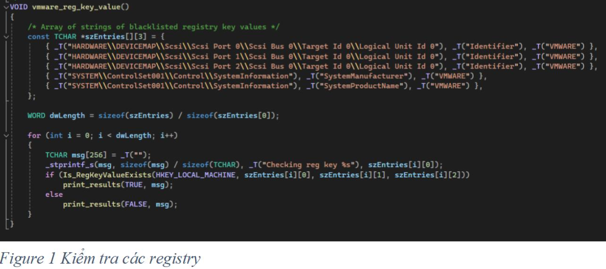

Hình 1: Hàm vmware_reg_key_value sẽ kiểm tra trong registry xem có từ khóa VMWARE nào không, nếu có thì là đang trong môi trường VMWARE.

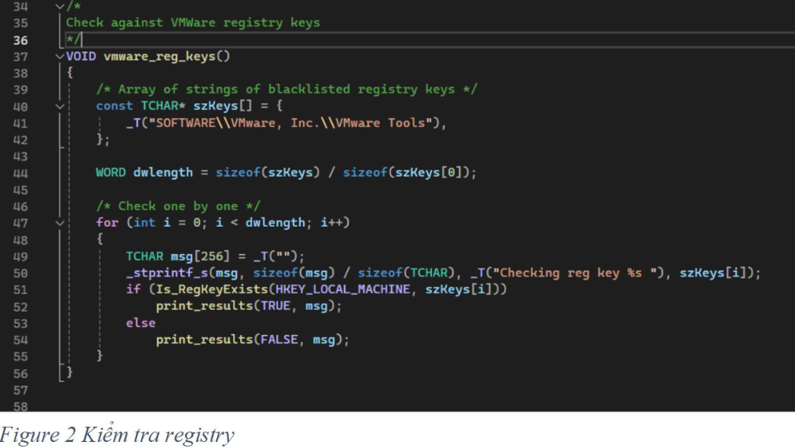

Hình 2 cho thấy hàm vmware_reg_keys sẽ kiểm tra có cài đặt Vmware Tools trong registry không, nếu có thì đang trong môi trường vmware.

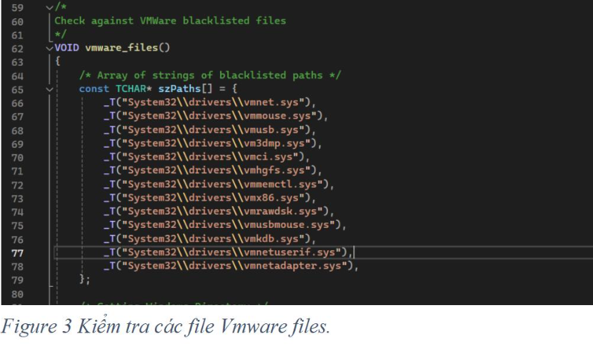

Hình 3 sẽ kiểm tra các file trong hệ thống có chứa vmware không.

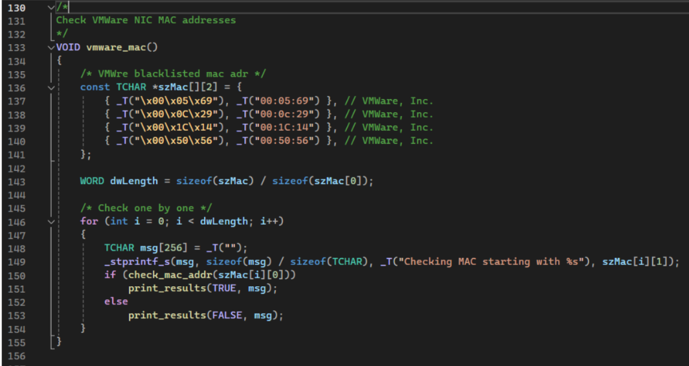

Hình 4 dùng để kiểm tra các địa chỉ MAC của VMWARE

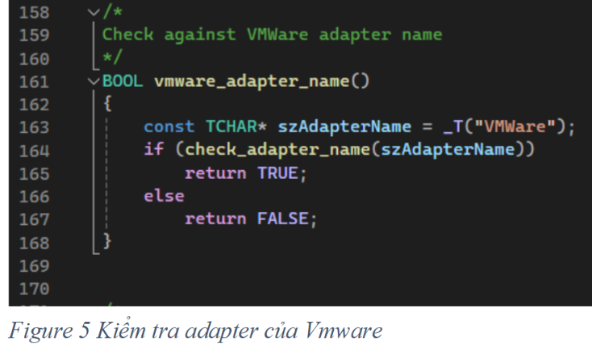

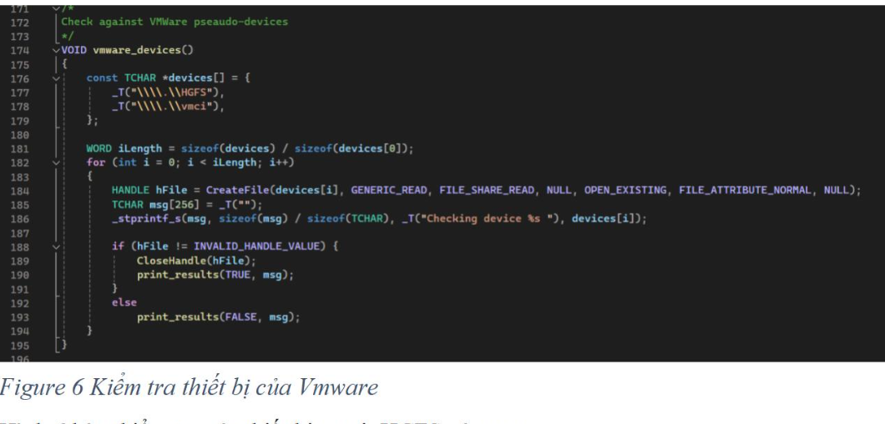

## Nhận biết, phát hiện đang bị gỡ lỗi (debugging).

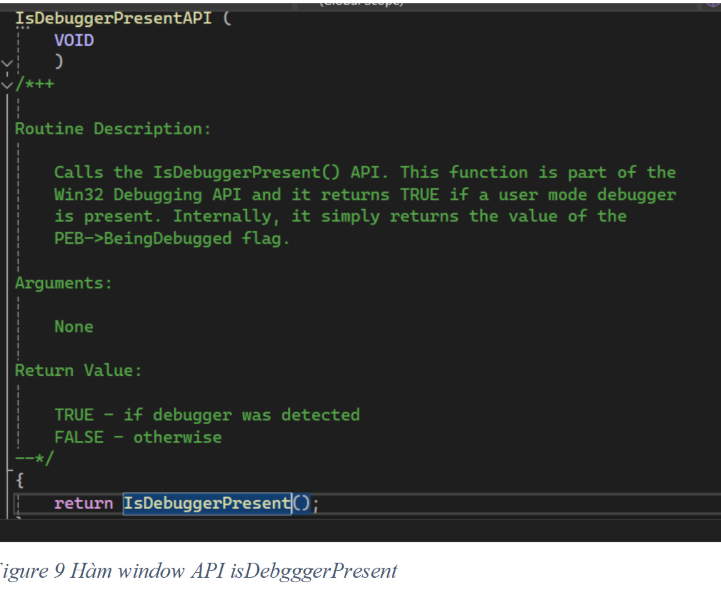

Hình 9 sử dụng hàm IsDebuggerPresent, hàm này của thư viện window API dùng để kiểm tra user mode debug có được bật không.

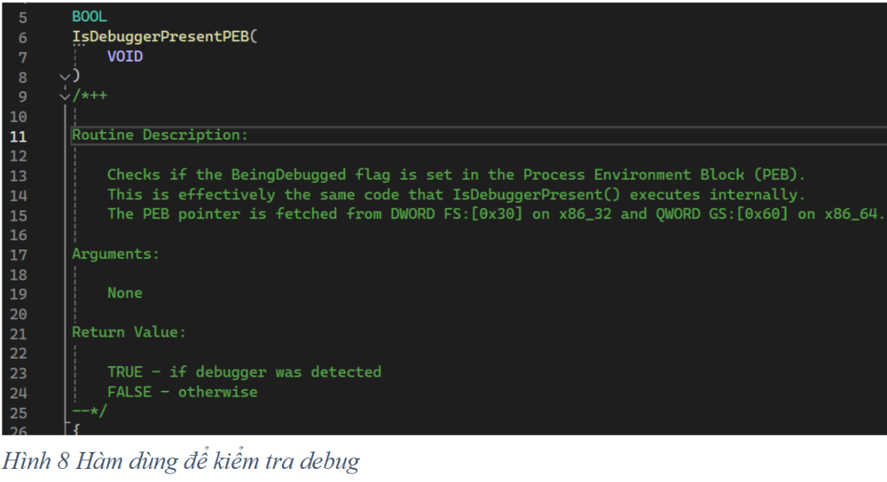

Hình 8 là hàm tương tự IsDebuggerPresent dùng để kiểm tra cờ BeingDebugged có được bật không

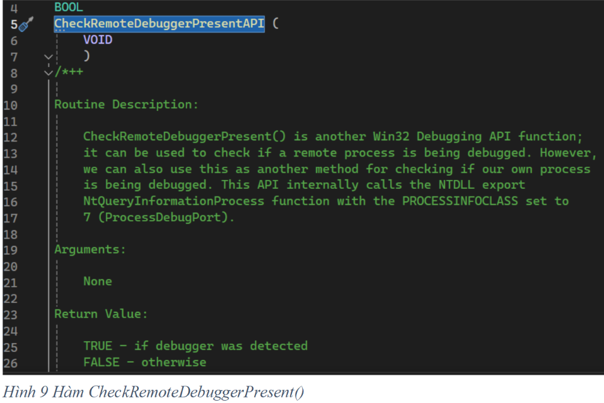

Hình 9 là hàm của Win api. Dùng để kiểm tra tiến trình có bị debug không

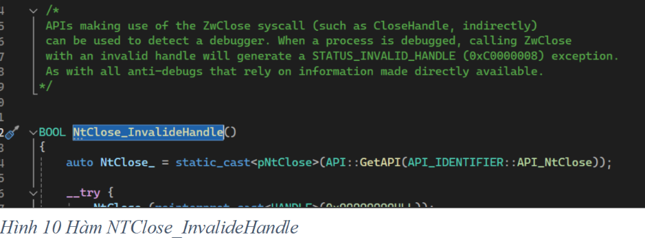

Hình 10, hàm này sẻ trả về True nếu phát hiện debug. Nguyên lý là khi tiến trình bị debug nếu gọi hàm này sẽ trả về status code là 0xC0000008

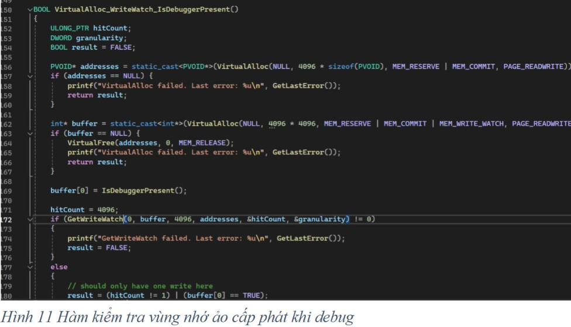

Nguyên lý của hàm này :

- Phát hiện debug bằng hàm IsDebuggerPresent(một hàm của window api)

- Sử dụng cờ MEM_WRITE_WATCH: sử dụng cờ này để theo dõi hoạt động ghi vùng nhớ này. Hàm GetWriteWatch sẽ cung cấp thông tin về các trang nhớ từ khi cấp phát đã bị ghi vào.

- Khi debugger can thiệp nó sẽ gây ra hoạt động không mong muốn và ghi vào vùng nhớ. Vì hàm GetWriteWatch cho biết có bao nhiêu trang nhớ đã bị ghi nên nếu số trang nhớ bị ghi không phải 1 thì chứng tỏ có hoạt động của debugger. Ngoài ra hàm IsDebuggerPresent trả về True cũng thể hiện đang bị debug.

## Kịch bản demo

- Ở đây em sử dụng file NOTEPAD.exe để thực hiện chèn payload vào section cuối của file, section có tên là .infected.

### Với phát hiện máy ảo:

- Em thực hiện thử nghiệm trên 2 môi trường là Window Vmware (máy ảo VMware)và Window trên Amazon cloud(em mặc định đây là máy thật).

### Với phát hiện debugger :

Em thực hiện chạy bằng phần mềm X64dbg ở chế độ debug, em chạy trên máy ảo Vmware và tắt chế độ phát hiện máy ảo đi. Khi em debug thì mã độc sẽ phát hiện và không thực thi lây nhiễm. Còn khi em dùng chế độ chạy bình thường thì mã độc sẽ lây nhiễm.

Kết quả: khi chạy trên phần mềm VMware, mã độc sẽ in ra màn hình phát hiện môi trường Vmware và không thực thi mã độc. Ngược lại khi chạy trên môi trường của window của amazon thì sẽ thực thi payload vào file NOTEPAD.exe và in ra màn hình 20521143

Khi chạy trên máy ảo và tắt chế độ phát hiện máy ảo, nếu chạy bằng x64dbg thì mã độc sẽ in ra màn hình phát hiện debugger và không thực thi payload. Ngược lại nếu em chạy bằng cửa sổ dòng lệnh của window thì nó sẽ thực thi payload và khi chạy file NOTEPAD.exe sẽ in ra màn hình của sổ có 20521143.

