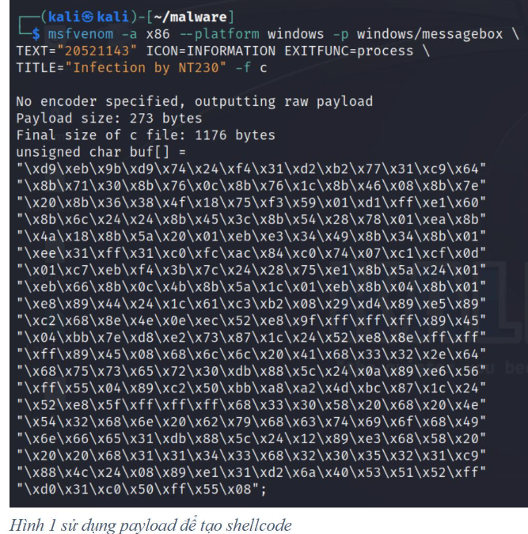
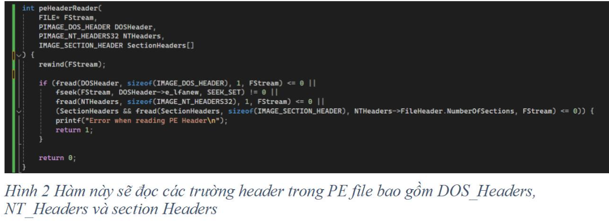
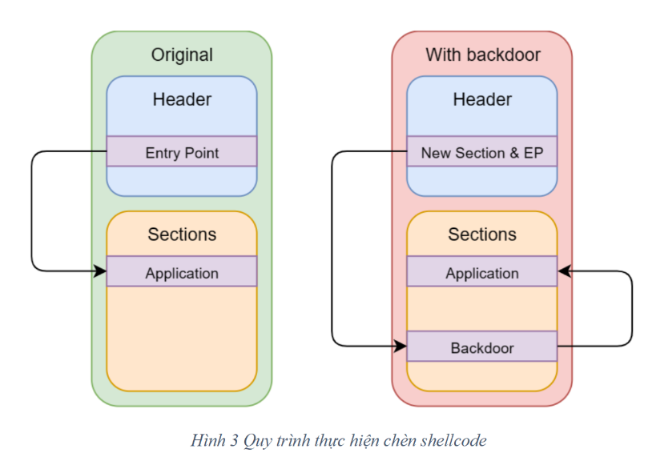
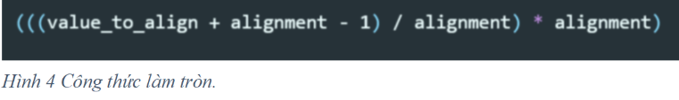
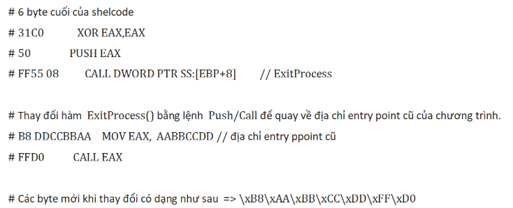
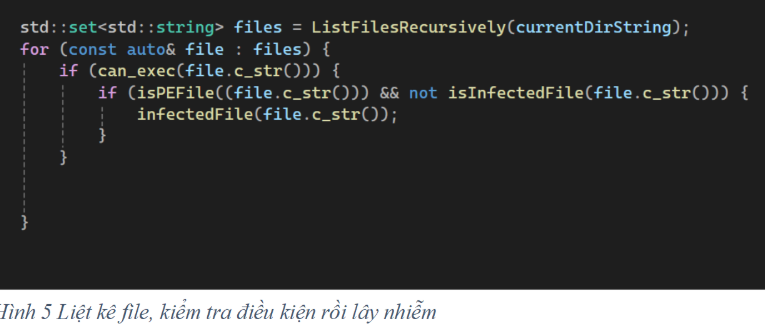
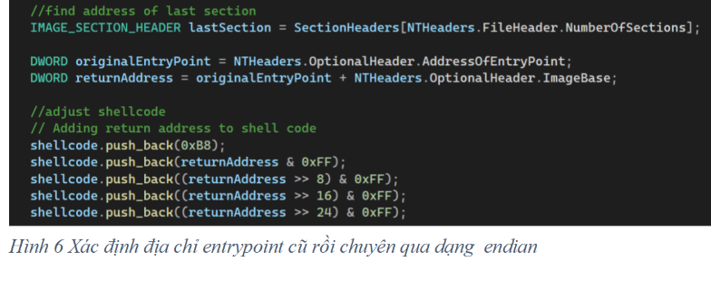
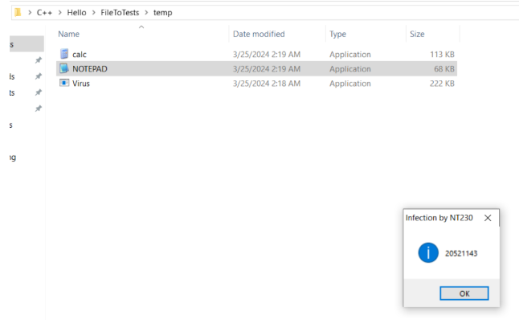

# File Infecting Virus & Advanced Virus Techniques

# Mô tả

Viết chương trình lây nhiễm virus vào tập tin thực thi (tập tin thực thi trên Windows 
– PE file 32 bits) có tính năng đơn giản (mục đích demo giáo dục) như yêu cầu bên 
dưới.
Về chức năng, mục đích:
- Hiển thị thông điệp ra màn hình thông qua cửa sổ “pop-up” với tiêu đề cửa sổ là 
“Infection by NT230” và cấu trúc thông điệp là “MSSV01_MSSV02_MSSV03” 
(thông tin MSSV của các thành viên trong nhóm). Lưu ý: không có dấu “”.
- Hoàn trả chức năng gốc ban đầu của chương trình bị lây nhiễm (không phá hủy 
chức năng của chương trình chủ).
- Tóm lại: một tập tin bị nhiễm virus sẽ in ra thông điệp khi người dùng kích hoạt 
chương trình, cố gắng lây nhiễm sang tập tin khác trong cùng thư mục, rồi thực 
thi chức năng ban đầu của tập tin. Đối với việc lây nhiễm sang một tập tin khác, 
nếu đối tượng là một tập tin đã bị nhiễm, chương trình virus sẽ bỏ qua. Nếu đối 
tượng là tập tin không bị nhiễm, hoạt động lây nhiễm payload vào tập tin thực thi 
sẽ được kích hoạt.
Về cách lây nhiễm:
- Mức yêu cầu 01 - RQ01 : Thực hiện chèn mã độc vào process bình thường bằng 
cách sử dụng section .reloc, tạo và nối mới section trong tập tin thực thi để tiêm 
payload của virus (hoặc kỹ thuật process hollowing).
- Mức yêu cầu 02 - RQ02 : Virus đạt được RQ01 và có khả năng lây nhiễm qua 
các file thực thi khác cùng thư mục khi người dùng kích hoạt tập tin chủ.
- Mức yêu cầu 03 - RQ03 : Thay vì thay đổi Entry-point của chương trình, Hãy 
áp dụng lần lượt 02 chiến lược lây nhiễm trong nhóm kỹ thuật Entry-Point 
Obscuring (EPO) virus – che giấu điểm đầu vào thực thi của mã virus (virus code)
cho Virus đã thực hiện ở RQ01/RQ02. Một số dạng EPO-virus có thể xem xét để 
thực hiện yêu cầu này bao gồm:
o Call hijacking EPO virus
o Import Address Table-replacing EPO virus.
o TLS-based EPO virus.

# Triển khai

## THIẾT KẾ PAYLOAD LÂY NHIỄM:

### Shellcode 

Sử dụng công cụ msfvenom của để tạo shellcode, nội dung shellcode này sẽ hiển thị một message box với nội dung và tiêu đề như yêu cầu trên.

Trong source code C++, sử dụng vector để lưu giá trị shellcode

### Đọc các thành phần trong tệp tin PE và chỉnh sửa địa chỉ entry point.

Xây dựng hàm đọc và lấy ra các thông tin như DOS_Header, NT_Headers và Section_Headers

Đoạn code trên sẽ tạo một section mới có tên là “.infect”, kích thước section là kích thước shellcode + 14(dùng để chèn thêm các vị trí return address và padding). Kết quả hàm trả về là vị trí của section mới trên file.

### Thêm mới section.

#### Ý tưởng thực hiện
Xác định kích thước của đoạn shellcode cần chèn vào, rồi tạo section mới có kích thước bằng kích thước của đoạn shellcode.
Cần xác định section cuối, sau đó thay đổi các tham số mới dựa trên section cuối.

Sau khi thay đổi địa chỉ Entrypoint của chương trình và chỉ đến địa chỉ của shellcode, sau khi shell code được thực thi xong sẽ có thể quay về địa chỉ ban đầu entrypoint cũ để chương trình thực hiện chức năng gốc.

#### Tạo section mới:

Thiết lập tên section là ‘.infect’ và byte cuối cùng gán là NULL.

Địa chỉ VirtualAddress sẽ bằng địa chỉ VirtualAddress của section cuối cộng với kích thước của section cuối rồi làm tròn bằng sectionAlignment trong Optional Headers.

Kích thước VirtualSize sẽ gán là kích thước của shellcode rồi làm tròn bằng sectionAlignment.

PointerTorawData sẽ bằng PointerToRawData của section cuối cộng với SizeOfRawData của section cuối sau đó làm tròn bằng FileAlignment trong Optional Headers.

SizeOfRawData sẽ bằng kích thước của shellcode và làm tròn bằng FileAlignment.

Characteristics sẽ gán là đọc, viết, thực thi và chứa code.

Công thức để làm tròn của các trường có dạng như sau:

Trong đó:

Alignment: là FileAlignment hoặc SectionalAlignment trong OptionalHeader.

Value_to_align: Giá trị cần làm tròn.

#### Thay đổi địa chỉ EntryPoint của chương trình

Sau khi tạo mới section địa chỉ entry point mới của chương trình trong optional Headers sẽ chỉ đến địa chỉ PoinToRawData của section mới vừa tạo.

#### Chỉnh sửa shellcode để sau khi thực thi chương trình sẽ quay về địa chỉ entry point ban đầu
Vì trong payload do metasploite tạo ra, có sử dụng hàm ExitProcess(), nên em sẽ thay hàm này bằng lệnh call để nhảy đến địa chỉ EntryPoint.

Địa chỉ EntryPoint cũ khi thêm vào shellcode sẽ có dạng LittleEndian.

## Lây nhiễm sang các tệp tin cùng thư mục

Viết hàm liệt kê các file trong thư mục hiện tại, rồi kiểm tra các file đó có phải là một file thực thi PE hợp lệ không, sau đó lây nhiễm.

### Bỏ qua các file đã bị lây nhiễm:

Chương trình sẽ kiểm tra section cuối của chương trình có phải tên là .infect không. Nếu có thì bỏ qua, nếu không sẽ lây nhiễm.

Đoạn code trên sẽ liệt kê tất cả các file trong thư mục hiện tại sau đó kiểm tra xem file có phải là file PE hợp lệ không và đã bị lây nhiễm chưa. Hàm infectedFile sẽ lây nhiễm file bằng cách tạo section mới, thay đổi địa chỉ entrypoint, thêm địa chỉ entry point cũ vào shellcode sau đó chèn shellcode vào vùng nhớ của section mới tạo

## DEMO lây nhiễm tệp tin trong cùng thư mục:

Sau khi lây nhiễm Các file là Notepad và Calc đều bị lây nhiễm.

